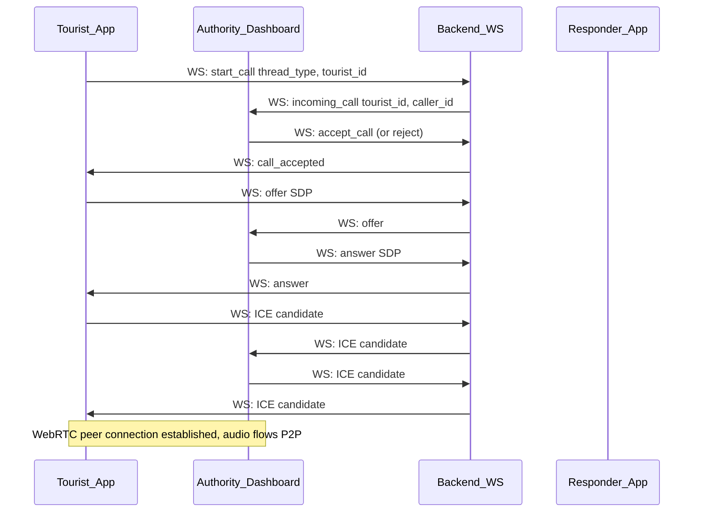

# Two-Way Communication Plan: Chat + Call

## Overview

Add real-time **text chat** and **voice/video call** between:
- Tourist app and Authority dashboard
- Authority dashboard and Responder app

Any side can start a conversation. True real-time via WebSockets for chat; calls via WebRTC (optionally backed by Twilio or similar).

---

## Part 1: Text Chat (unchanged)

- **Channel:** Text chat; one thread per tourist (tourist–authority) and one thread per incident (authority–responder).
- **When available:** Tourist–authority anytime; authority–responder when incident is ASSIGNED.
- **Backend:** `Message` model, REST `POST/GET /api/messages`, WebSocket `/ws/chat` for subscribe/broadcast.
- **Frontend:** Shared chat component, WebSocket hook, integration in tourist page, dashboard, responder page.

(Full chat details are in the original plan; implementation order: backend DB + REST, then WebSocket, then frontend chat UI.)

---

## Part 2: Call Feature (added)

### Scope

- **Voice calls:** Supported for both tourist–authority and authority–responder (same thread semantics as chat).
- **Video calls (optional):** Can be added in Phase 2; same flows, just enable video track.

### Recommended approach: WebRTC + backend signaling

- **WebRTC** handles the actual audio (and optionally video) between browsers; no media flows through your server.
- **Signaling** (offer/answer/ICE candidates) goes through your backend so both peers can connect. Options:
  1. **Signaling over WebSocket:** Reuse `/ws/chat` or add a dedicated `/ws/call`; clients send `{ action: "call_signaling", ... }` and server forwards to the other peer in the same thread.
  2. **Signaling over REST:** e.g. `POST /api/calls/signal` with target thread + payload; other client polls or gets pushed via existing WebSocket. WebSocket is cleaner for real-time signaling.

### Flow (high level)

Same pattern for authority–responder using `incident_id` and thread.

### Backend (FastAPI)

- **WebSocket:** Extend the same `/ws/chat` (or dedicated `/ws/call`) to handle call signaling:
  - **start_call:** `{ action: "start_call", thread_type, tourist_id or incident_id, caller_role, caller_id }`. Server notifies the other side(s) subscribed to that thread (e.g. authority sees “Tourist X is calling” for tourist_authority; responder sees “Authority is calling” for authority_responder).
  - **accept_call / reject_call:** `{ action: "accept_call" | "reject_call", call_id }`. Server forwards to caller.
  - **signaling:** `{ action: "signaling", call_id, payload: { type: "offer"|"answer"|"ice", sdp|candidate } }`. Server forwards payload to the other peer in that call. No need to persist SDP/ICE; just relay.
- **Optional:** Store minimal call metadata (e.g. `call_id`, `thread_type`, `tourist_id`/`incident_id`, `caller`, `started_at`, `ended_at`) in a `calls` table for “recent calls” or analytics; not required for the call to work.

### Frontend

- **Tourist app:** In the same chat panel (or a “Call” tab), add “Call authority” button. On click: open WebRTC peer connection, send `start_call` over WS; when authority accepts, send offer and exchange ICE candidates via WS; when connection is established, show local/remote audio (and optionally video) and “End call” button.
- **Authority dashboard:** When viewing a tourist thread, show “Call tourist” and “Incoming call from tourist X” (with accept/reject). When viewing an incident thread with responder, show “Call responder” and “Incoming call from responder”. Same WebRTC flow: offer/answer/ICE over WS, then media.
- **Responder app:** For assigned incident, show “Call authority” and handle “Incoming call from authority”; same WebRTC flow.

Use the **browser WebRTC APIs** (`RTCPeerConnection`, `getUserMedia`) so no extra backend media server is needed. For mobile or weak networks, optional later: Twilio/Vonage for more reliable calls (then you’d use their SDKs and optionally keep WebRTC for web-only).

### Implementation order (calls)

1. Backend: Add call signaling messages to WebSocket (start_call, accept/reject, signaling relay). Optional: `calls` table and `call_id` for multi-tab/cleanup.
2. Frontend: Shared “call” hook or small module (create `RTCPeerConnection`, send offer/answer/ICE via WS, handle remote stream). Reuse same WS connection as chat if possible.
3. Tourist: “Call authority” button and incoming-call UI (accept/reject).
4. Authority: “Call tourist” and “Call responder” + incoming-call UI per thread.
5. Responder: “Call authority” and incoming-call UI for assigned incident.
6. Optional: Video (getUserMedia video track, add to peer connection, show in UI).

### Edge cases

- **Who can call whom:** Same as chat – tourist can call authority (one thread per tourist); authority and responder can call each other only for ASSIGNED incidents (one thread per incident).
- **Multiple devices:** If authority has two tabs open for same thread, both get “incoming call”; first to accept gets the call; optional: broadcast “call_ended” so other tabs clear state.
- **Reconnect:** If WS drops during signaling, call fails; user can start a new call. Optional: short-lived “call_id” and “call_ended” so UI resets.

---

## Combined implementation order

1. Chat: Backend Message model + REST + WebSocket; frontend chat component and integration (tourist, authority, responder).
2. Calls: Backend call signaling over WebSocket; frontend WebRTC + “Call” / “Incoming call” UI in tourist app, dashboard, responder app.
3. Optional: Video, call history table, “recent calls” list.

No Twilio (or other PSTN) required for the in-browser call feature; add later if you need “call from browser to phone” or higher reliability on mobile.
